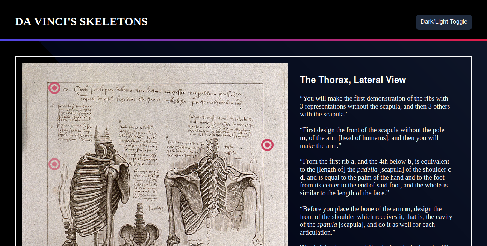
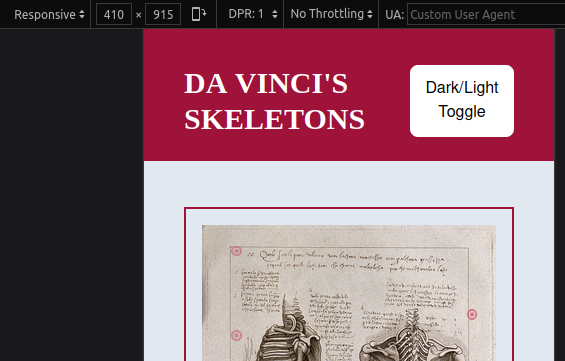

# Da Vinci's Skeletons

### Making Italian Chickenscratch Legible with Tailwind CSS, Express.js, and Postgres

Leonardo da Vinci (1452 - 1519) was an artist and a scientist, which turned out to be very complementary vocations. Renowned for his paintings, he also left behind notebooks crammed with diagrams of exotic plants, the inner workings of the human body, and extraordinary machines impossible to build in his own time. 

When pages from these notebooks are circulated through the Internet, exhibited in public spaces, or thrown into documentaries as B-roll, the stars of the show are often the richly textured drawings. However, in between these diagrams, filling almost every space not already occupied, are careful annotations in Leonardo's own hand. These texts, and their English translations, don't travel at the same speed as the images-- they are, for the most part, locked in thick books, very old books besides.

Digitization has revealed the contents of these books to the search engines, and today tomes like Malley and Saunders's [Leonardo on the Human Body](https://archive.org/details/leonardoonhumanb0000leon) are more widely available than ever before. 

### The Application

To help this process along, I created a web application that can display a page from Leonardo's notebooks, and highlight the text with markers that, when clicked, open up a translation of the nearby text.

The application is an Express.js application, which serves the webpage and provides an API for querying a Postgres database. Text stored in the database is used to re-render the information panel. Styling was done with Tailwind CSS, which offers a large number of small CSS classes on demand. It's a useful tool, although this app could easily be built without it.

The application also has a light mode, and on smaller screens it rearranges its elements for readability, shifting the information panel underneath the image.

### How to Use

Deployment is coming soon.

To run this application for yourself, clone the repository. Then, start a Postgres database and fill it with the information in the provided PDF. Make a copy of "db_login_blank.js" named "db_login.js", and fill that copy with the login information for your database (Make sure your user has SELECT privileges GRANTed to them). Then, run the application with "npm start" in the top level.